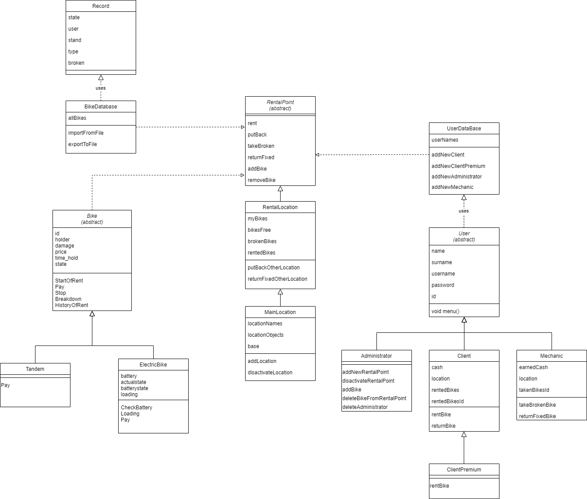

**Rowery miejskie**

Projekt ma na celu udostępnienie możliwości wypożyczenia rowerów. Trzema głównymi aspektami projektu są 
użytkownicy, rowery i wypożyczalnia. Użytkownik będzie mógł wypożyczyć rower na określoną ilość czasu, po 
czym musi zwrócić do jednego z punktów wypożyczalni. 

**Członkowie**

    Krupa Olga gr.108
    Kwoka Kinga gr.108
    Roszczyk Ewa gr.108

**Początkowy podział pracy**

Klasy 
- rower - obsługa danego roweru, o przypisanym indeksie; informacja o stanie(wolny/zajęty) ; 
	czas do końca wypożyczenia; numer lokalizacji (stojak). 
- wypożyczalnia - baza rowerow ; dostepne stojaki; przypisanie rowerów do stojaków;
	wiadomośc o wolnym miejscu przy stojaku; wiadomość o zajętych rowerach.
- użytkownicy - Dane: imię nazwisko, indeks w bazie użytkowników; logowanie : login i hasło;
	numer wypożyczonego roweru (jeśli taki jest); możliwość dodania nowego użytkownika do bazy.

Opis klas
- Klasa Bike - jej 2 głównymi funkcjami są StartOfRent oraz Stop.       
Po sprawdzeniu przez wypożyczalnie stanu roweru, wypożyczalnia wywołuje ‘StartOfRent’ która zwalnia stojak do którego był przypięty rower oraz rozpoczyna czas wypożyczenia. Druga funkcja - ‘Stop’ jest odpowiedzialna za zwrot roweru.
Zapisuje dane do bazy oraz zwalnia użytkownika od danego roweru.
Pobiera również z konta odpowiednią sumę (różnica czasu od wypożyczenia roweru do przypięcia do wolnego stojaka). Funkcja również zapisuje do historii wypożyczeń. Klasy ElectricBike oraz Tandem dziedziczą po klasie Bike.
Wszystkie  klasy różnią się funkcją Pay. ElectricBike posiada dodatkową funkcję asynchroniczną rozładowującą baterię roweru oraz po oddaniu funkcję która ładuje baterię ponownie do 100%. (Krupa Olga)

- Klasa BikeDatabase- nadaje rowerom numery oraz przechowuje i zwraca informacje o ich stanie i aktualnym użytkowniku/ stojaku.
Może zostać zaimportowana z przykładowego pliku database.txt. (Kwoka Kinga)
- Klasa RentalPoint- klasa abstrakcyjna. Instancje klasy (MainLocation i RentalLocation) powstają na podstawie bazy rowerów. Na życzenie użytkownika MainLocation zarządzająca wszystkimi lokalizacjami zwraca użytkownikowi numery wolnych rowerów w jego aktualnej lokalizacji.
Kiedy użytkownik dokona wyboru roweru, wypożyczalnia przekazuje klasie Bike informacje o użytkowniku i rozpoczęciu wypożyczenia.
Analogicznie przy zwracaniu roweru, przekazuje informacje o zakończeniu do obiektu klasy Bike. Zwrot możliwy jest w dowolnej lokalizacji wypożyczalni.(Kwoka Kinga)
- Klasa Client (dziedzicząca z klasy User) pozwala użytkownikowi na stworzenie swojego własnego konta oraz dostępu do niego za pomocą loginu i hasła, które 
można zmienić. Użytkownik na swoim koncie ma możliwość wypożyczyć, bądź zwrócić rower/y oraz sprawdzić aktualny stan wypożyczenia. Dodatkowo użytkownik przechowuje na 
swoim koncie pieniądze, służące do zapłaty za wypożyczenie. Istnieje możliwość dodanie pieniędzy do swojego konta. Klasa userBase przechowuje bazę wszystkich użytkowników oraz pozwala 
wyeksportować ją do pliku .txt. Obecnie do projektu została dodana również klasa Administrator (dziedzicząca po klasie User). Dzięki niej zostaje stworzene konto administratora, 
które pozwala na zarządzanie kontami klientów, bazą rowerów oraz bazą wypożyczalni. Administrator ma również możliwość dodania/usunięcia innego administratora. 
W projekcie dostępne są dwa przykładowe konta testowe - jedno klienta (**login:** user **hasło:** haslo) oraz jedno aministratora (**login:** admin **hasło:** haslo). 
(Roszczyk Ewa)

Na powyższym diagramie przedstawiona jest hierarchia klas zgodnie z językiem UML.

**Szczegółowy opis klas**
- Rozszerzony opis klasy Bike oraz dziedziczących po nich :ElectricBike oraz Tandem.                    
Funkcja StartOfRent służy do rozpoczęcia wypożyczenia. Sprawdzany jest stan konta użytkownika, jeśli nie ma wystarczająco dużo środków na koncie, użytkownik może przelać środki na konto (odesłanie do funkcji ‘user.transferMoney()’).  Jeśli na koncie znajduje się odpowiednia kwota  (zależy od typu roweru), rower zwalniany jest ze stojaka, ustawiamy status roweru jako zajęty, i przypisujemy dany rower do osoby. Jednocześnie zostanie wywołana funkcja asynchroniczna ‘Breakdown’, która jest odpowiedzialna za losowe zepsucia roweru. Szansa na uszkodzenie zależy od typu roweru (Bike i Tandem 15%, ElectricBike 30%).  
Podczas funkcji StartOfRent wywołana przez ElectricBike dodatkowo uruchamia funkcję asynchroniczną CheckBattery która rozładowuje baterię. Funkcja poinformuje użytkownika o niskim poziomie baterii.       
Funkcja Stop służy do zwrotu roweru. Funkcja StandAssignment przypisuje rower do wolnego stojaka. Jeśli rower został przypisany do stojaka, zostaną wykonane dalsze instrukcję. Czas wypożyczenia zostanie zatrzymany, oraz zostanie wykonana funkcja Pay(), inna dla każdego typu rowerów. Sprawdza również czy rower nie uległ uszkodzeniu, jeśli tak wysyła zawiadomienie do bazy. W zależności czy rower został uszkodzony, do historii wypożyczeni zostaje wpisana odpowiednia formuła. Następnie status roweru zmieniany jest na wolny i usuwa przypisanie roweru do użytkownika.         
ElectricBike posiada również funkcję asynchroniczną służąca do ładowania baterii roweru. Dopóki bateria nie naładuje się do 100% status roweru pozostanie ‘zajęty’.
 (Krupa Olga)

- Rozszerzony opis klas dziedziczących po RentalPoint   
    Do utworzenia wypożyczalni niezbędna jest baza rowerów. Importowana jest z pliku database.txt.
Na podstawie obiektu BikeDatabase i ewentualnie dostarczonych nazw tworzona jest główna wypożyczalnia MainLocation i obiekty pozostałych wypożyczalni RentalLocation.
Każda funkcja odwołuje się do obiektu głównej wypożyczalni, który w zależności od dostarczonego parametru lokalizacji przekierowuje do odpowiedniego obiektu typu RentalLocation.
Metody zmieniające stan roweru zmieniają go również w bazie, która jest podstawą funkcjonowania wypożyczalni.
Funkcjonalność RentalLocation to wypożyczanie i zwracanie różnego typu rowerów przez użytkowników, dodawanie i usuwanie rowerów przez administratora
oraz możliwość zabrania do naprawy roweru przez mechanika. Wszystkie zwroty mogą odbywać się w lokalizacji innej niż lokalizacja wypożyczenia. 
(Kinga Kwoka)

- Rozszerzony opis klas UserDataBase, User, Client, ClientPremium, Administrator oraz Mechanic. Klasa User jest klasą abstrakcyjną, po której dziedziczą klasy
Client, Administrator oraz Mechanic. Dodatkowo po klasie
Client dziedziczy ClientPremium.
    - Client oraz ClientPremium mają możliwość wypożyczyć 
oraz zwrócić rower(y). Różnica między nimi polega na tym,
iż premium daje możliwość wypożyczenia nie tylko podstawowych
rowerów, ale także: rowery elektryczne oraz tandemy. 
Każdy z klientów ma swoje własne konto, które jest obciążane 
płatnościami za wypożyczenia oraz które można doładować. 
Ze względu na to, iż nasz system przewiduje możliwość posiadania
więcej niż jednej stacji rowerowej, klienci mogą zmieniać swoją 
lokalizację. Oczywiście poza tymi funkcjami, każdy z klientów ma 
możliwość zmiany hasła, wyświetlenia listy stacji rowerowych,
swojej lokalizacji, stanu konta oraz listy wypożyczonych
rowerów. 
    - Administrator zarządza bazą użytkowników. Ma on możliwość
dodania oraz usunięcia konta każdego z nich: Client, 
ClientPremium oraz Mechanic. Może również modyfikować dane konta:
imię, nazwisko, nick oraz hasło każdego użytkownika. 
Zarządza on również stacjami 
rowerowymi. Może dodać bądź zdezaktywować stację oraz dodać bądź
usunąć rower ze stacji. 
    - Mechanic natomiast ma możliwość zabrania roweru, aby go naprawić oraz 
zwrotu naprawionego roweru. On również posiada swoją lokalizację, którą może
zmieniać oraz konto, z którego może wypłacać pieniądze. Za każdą naprawę jego
konto powiększa się o odpowiednią kwotę. Tak samo jak Client oraz ClientPremium
może on zobaczyć listę rowerów zabranych do naprawy oraz listę stacji
rowerowych. 
    - Klasa UserDataBase przechowuje wszystkich użytkowników rowerów miejskich.
Istnieje możliwość eksportu bazy do pliku .txt. 

